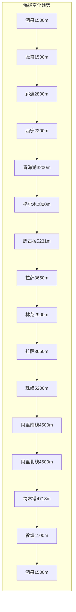

# 青甘大环线 + 西藏大环线 29天自驾深度规划

## 行程总览

- **出发日期**：3月1日（从酒泉出发）
- **返程日期**：约3月29日（回到酒泉）
- **总天数**：29天（约4周）
- **总里程**：约 13,000km
- **最高海拔**：唐古拉山口 5,231m / 珠峰大本营 5,200m / 马攸木拉山口 5,216m

```mermaid
graph LR
    subgraph phase1 [Phase1 青甘东半环 8天]
        A[酒泉] --> B[张掖]
        B --> C[祁连]
        C --> D[西宁]
        D --> E[青海湖]
        E --> F[茶卡]
        F --> G[大柴旦]
        G --> H[格尔木]
    end
    subgraph phase2 [Phase2 进藏 3天]
        H --> H1[沱沱河]
        H1 --> I[安多]
        I --> J[拉萨]
    end
    subgraph phase3 [Phase3 拉萨 3天]
        J --> J1[布达拉宫]
    end
    subgraph phase4 [Phase4 林芝桃花 3天]
        J1 --> K[巴松措]
        K --> K1[林芝鲁朗]
        K1 --> J2[返回拉萨]
    end
    subgraph phase5 [Phase5 阿里南线 6天]
        J2 --> O[珠峰]
        O --> P[萨嘎]
        P --> Q[冈仁波齐]
        Q --> R[玛旁雍措]
        R --> S[札达古格]
        S --> S1[盐湖乡]
    end
    subgraph phase6 [Phase6 阿里北线 4天]
        S1 --> T1[措勤]
        T1 --> T2[当惹雍措]
        T2 --> T3[色林错]
        T3 --> V[纳木错]
    end
    subgraph phase7 [Phase7 返程青甘西半环 4天]
        V --> W1[安多]
        W1 --> W[格尔木]
        W --> X[敦煌]
        X --> Y[嘉峪关]
        Y --> Z[酒泉]
    end
```

## 核心路线策略

### 1. 青甘环线拆分（零回头路）

- **去程走东半环**：酒泉→张掖→祁连→西宁→青海湖→茶卡→大柴旦→格尔木→进藏
- **回程走西半环**：阿里北线→纳木错→安多→格尔木→敦煌（莫高窟）→嘉峪关（关城）→酒泉（不回拉萨）
- 青甘大环线所有核心景点全覆盖，无一遗漏

### 2. 先林芝后阿里（最优时间衔接）

- 3月14-20日走林芝：米林河谷、索松村桃花3月中旬已开，波密桃花沟3月下旬进入盛花期
- 3月21日起走阿里南线：3月底4月初气温逐渐回升，比3月中旬走阿里更安全
- 纳木错安排在阿里之后（4月初），湖面可能有壮观的开湖冰裂景象

### 3. 海拔梯度科学适应

张掖1500m → 祁连2800m → 青海湖3200m → 格尔木2800m → 拉萨3650m → 林芝2900m（降低恢复）→ 珠峰5200m → 阿里平均4500m → 纳木错4718m → 敦煌1100m（回程下降）

---

## 第一阶段：青甘东半环（D1-D7，7天）

| 天数 | 日期 | 行程 | 里程 | 海拔 |
|------|------|------|------|------|
| D1 | 3/1 | 酒泉 → **张掖**（大佛寺 + 七彩丹霞日落） | 220km | 1500m |
| D2 | 3/2 | 张掖 → 扁都口 → **祁连**（祁连山草原 + 卓尔山） | 200km | 2800m |
| D3 | 3/3 | 祁连（中午12:00出发）→ 门源 → **西宁**（下午到达） | 280km | 2200m |
| D4 | 3/4 | **西宁**（塔尔寺 + 进藏物资采购）→ 日月山 → **青海湖** → 返回**西宁**休整 | 300km | 3200m |
| D5 | 3/5 | 西宁 → **茶卡盐湖** → **德令哈**（晚上入住） | 500km | 3100m |
| D6 | 3/6 | 德令哈 → **大柴旦**（翡翠湖）→ **格尔木**（晚上入住） | 400km | 2800m |
| D7 | 3/7 | **格尔木** 全天休整 | 0km | 2800m |

**景点清单见"各途经点景点详细清单"章节。**

---

## 第二阶段：青藏线进藏（D8-D10，3天）

| 天数 | 日期 | 行程 | 里程 | 最高海拔 |
|------|------|------|------|---------|
| D8 | 3/8 | 格尔木 → 昆仑山口 → 可可西里 → **沱沱河**（住宿） | 420km | 4768m |
| D9 | 3/9 | 沱沱河 → 唐古拉山口 → **安多** | 250km | 5231m |
| D10 | 3/10 | 安多 → 那曲 → 念青唐古拉山 → **拉萨** | 460km | 4800m |

---

## 第三阶段：拉萨适应+游览（D11-D13，3天）

| 天数 | 日期 | 行程 |
|------|------|------|
| D11 | 3/11 | 上午休整适应 + 下午**布达拉宫** |
| D12 | 3/12 | **大昭寺** + 八廓街 |
| D13 | 3/13 | **色拉寺**（辩经）+ **哲蚌寺** + **罗布林卡** |

---

## 第四阶段：林芝桃花（D14-D16，3天）

| 天数 | 日期 | 行程 | 里程 | 亮点 |
|------|------|------|------|------|
| D14 | 3/14 | 拉萨 → **巴松措** → **林芝八一** | 400km | 翡翠圣湖 |
| D15 | 3/15 | **色季拉山口** → **鲁朗林海** → 返回八一 | 160km往返 | 鲁朗石锅鸡 |
| D16 | 3/16 | 林芝 → **拉萨** | 400km | 拉林高速 |

---

## 第五阶段：阿里南线去程（D17-D22，6天）

这是全程最硬核的一段，穿越世界屋脊的屋脊，从珠峰到冈仁波齐，从玛旁雍措到古格王朝。

| 天数 | 日期 | 行程 | 里程 | 海拔 |
|------|------|------|------|------|
| D17 | 3/17 | 拉萨 → **羊卓雍措** → **卡若拉冰川** → 江孜（**白居寺**）→ **日喀则** | 370km | 4400-4990m |
| D18 | 3/18 | **日喀则**（扎什伦布寺）→ 拉孜 → 定日 → **绒布寺**（日落+星空） | 450km | 5000m |
| D19 | 3/19 | 珠峰（日出）→ 老定日 → **佩枯措** → **希夏邦马峰**远眺 → **萨嘎** | 350km | 4500m |
| D20 | 3/20 | 萨嘎 → 仲巴 → 帕羊 → **马攸木拉山口**(5216m) → **塔钦** | 480km | 4600m |
| D21 | 3/21 | **塔钦**（冈仁波齐远观）→ **玛旁雍措** → **拉昂错** → **札达**（**土林**日落） | 350km | 3800-4600m |
| D22 | 3/22 | **札达**（**古格王朝遗址**）→ **盐湖乡** | 350km | 4500m |

**D20 是全程最艰苦的驾驶日**：480km高原公路，翻越马攸木拉山口(5216m)，沿途补给极少。务必在萨嘎加满油、备足食物和水。

---

## 第六阶段：阿里北线 + 纳木错（D22-D25，4天）

从阿里南线尾部转入北线，穿越藏北无人区，途经多个绝美高原湖泊，最终在纳木错收尾。

| 天数 | 日期 | 行程 | 里程 | 亮点 |
|------|------|------|------|------|
| D22 | 3/22 | **札达**（古格王朝）→ 噶尔 → **盐湖乡** | 350km | 转入北线 |
| D23 | 3/23 | 盐湖乡 → **措勤**（**扎日南木错**） | 300km | 西藏第三大湖 |
| D24 | 3/24 | 措勤 → **当穷错** → **当惹雍措/文部南村** → **尼玛** | 300km | 苯教圣湖 |
| D25 | 3/25 | 尼玛 → **色林错** → **纳木错** | 500km | 西藏最大湖+纳木错 |

---

## 第七阶段：返程 + 青甘西半环（D26-D29，4天）

从纳木错直接北上青藏线，不回拉萨，最高效返程。

| 天数 | 日期 | 行程 | 里程 |
|------|------|------|------|
| D26 | 3/26 | 纳木错（日出）→ 当雄 → 那曲 → **安多** | 400km |
| D27 | 3/27 | 安多 → 沱沱河 → **格尔木** | 670km |
| D28 | 3/28 | 格尔木 → 大柴旦 → **敦煌**（傍晚到，**鸣沙山**日落） | 550km |
| D29 | 3/29 | **敦煌**（**莫高窟** 上午）→ **嘉峪关**（**关城** 下午）→ **酒泉** | 400km |

**D29 时间安排**：08:30 莫高窟 → 12:00 午餐出发 → 16:00 嘉峪关关城 → 18:00 到酒泉

---

## 各途经点景点详细清单

### 第一阶段：青甘东半环

#### D1｜酒泉 → 张掖（海拔1500m）｜220km

**详细时间安排：**

| 时间 | 内容 | 说明 |
|------|------|------|
| 08:00 | 酒泉出发 | 连霍高速G30，全程约220km |
| 10:30 | 抵达张掖市区 | 车程约2.5小时 |
| 10:40-12:00 | **张掖大佛寺** | 门票40元，游览约1.5小时 |
| 12:00-13:00 | 午餐 | 推荐甘州市场或明清街附近 |
| 13:30 | 出发前往七彩丹霞 | 市区到景区约40km，约40分钟 |
| 14:10-18:00 | **七彩丹霞景区** | 门票75元（含观光车），游览约3.5小时 |
| 18:40 | 返回张掖市区 | |
| 19:00 | 晚餐 + 休整 | |
| 夜宿 | **张掖市区** | |

**大佛寺游览要点（10:40-12:00）：**

- 3月冬季开放时间 08:30-18:00（**18:00关门无夜游**，因此安排在上午）
- 核心看点：**大佛殿**（亚洲最大室内卧佛，身长35米，金装彩绘）→ **弥陀千佛塔** → **藏经殿**（馆藏明代手抄金经） → **山西会馆**
- 整体游览约1-1.5小时，节奏轻松

**七彩丹霞推荐路线（14:10-18:00，约3.5小时）：**

景区有4个核心观景台，建议按以下顺序（观光车接送）：

1. **七彩云海台（1号台）** 14:30-15:00 — 视野最开阔，岩层色彩丰富，全景俯瞰
2. **七彩仙缘台（2号台）** 15:10-15:40 — 景区最高点，拍摄山体特写
3. **七彩锦绣台（5号台）** 15:50-16:20 — 木栈道近距离观赏丹霞纹理
4. **七彩虹霞台（4号台）** 16:30-18:00 — **色彩最鲜艳，日落最佳台！** 重点停留！3月日落约18:20-18:40，在此等待"黄金一小时"光线，丹霞达到最艳丽状态

> **提示**：原计划"晚上看大佛寺"因景区18:00关门无法实现，已调整为上午先看大佛寺、下午看丹霞日落。晚上可逛**张掖甘州夜市**品尝美食。

**美食推荐：** 搓鱼面、炒炮仗、臊面、驴肉黄面、卤肉炒炮、羊肉粉汤

---

#### D2｜张掖 → 祁连（海拔2800m）｜200km

**详细时间安排：**

| 时间 | 内容 | 说明 |
|------|------|------|
| 08:00 | 张掖出发 | 沿G227国道向南 |
| 08:40 | 进入**扁都口** | 祁连山重要隘口，海拔3500m |
| 09:00-10:00 | 穿越**祁连山大草原** | 沿G227一路自然风光，随时靠边拍照 |
| 10:30 | 抵达祁连县城 | 酒店放行李 |
| 11:00-12:00 | 可选：**阿柔大寺** | 距县城约20km，免费 |
| 12:00-13:00 | 午餐 | 祁连县城 |
| 13:30-16:30 | **卓尔山景区** | 门票80元（含观光车），游览约3小时 |
| 17:00-18:00 | 可选：**祁连鹿场** | 距县城约10km，门票约30元 |
| 18:00 | 晚餐 + 休整 | |
| 夜宿 | **祁连县城** | 海拔2800m，全程首次高海拔住宿 |

**扁都口 + 祁连山大草原（08:40-10:00，沿途风景）：**

- **扁都口**（距张掖约40km）：祁连山脉的重要隘口，海拔从1500m急升至3500m。3月积雪未化，两侧雪山夹道，山谷壮美。路边有观景停车区，可下车拍照
- **祁连山大草原**（扁都口至祁连全程）：中国最美六大草原之一。翻过扁都口后进入草原地带。3月草原尚未返青，但**雪山+枯黄草甸+蓝天**的苍茫景色极具西北特色。这不是封闭景区，而是G227沿途的自然风光，无门票，随时可以靠边停车拍照
- 沿途可能偶遇牦牛群、羊群在公路旁觅食

**卓尔山游览路线（13:30-16:30，约3小时）：**

3月淡季开放 08:00-18:00。

1. 景区大门乘坐**观光车**上山（约10分钟）
2. **山腰观景平台**：远眺八宝河谷全景 + 祁连县城
3. 沿栈道步行上山 → **丹霞观景区**：红色砂岩与对面牛心山白雪强烈色彩对比
4. **山顶烽火台**（最高点）：360度全景 —— 正面**阿咪东索/牛心山**（4667m，终年积雪），左侧拉洞峡，右侧白杨沟，脚下八宝河蜿蜒。3月牛心山顶白雪皑皑 vs 脚下丹霞赤红，极为震撼
5. 沿另一条栈道下山返回

> **D2小贴士**：张掖→祁连的G227国道是此行最美公路之一。海拔从1500m升至2800m，是全程海拔适应的第一次爬升。3月该段路面可能有暗冰，弯道减速、谨慎驾驶。祁连夜间约-10°C，选有暖气的酒店，当晚不洗澡、少活动、多喝水开始适应海拔。

**美食推荐：** 手抓羊肉（祁连羊肉鲜嫩无膻，全程最佳产地之一）、黄蘑菇炖羊肉、牦牛酸奶、青稞饼

---

#### D3｜祁连 → 门源 → 西宁（中午12:00出发，下午到达）

**中午12:00从祁连出发**，经G227转G0611，全程约280km，车程约4小时。

**门源途经：**

- **岗什卡雪峰**（远眺）：海拔5254m，3月雪景壮美
- **达坂山观景台**：海拔3940m，俯瞰门源河谷

**下午到达西宁，先办理入住**，晚上逛**东关清真大寺**（西北四大清真寺之一，夜晚绿色灯光外立面极为梦幻）、莫家街美食街

**美食：** 手抓羊肉、酿皮、甜醅、杂碎汤；推荐莫家街、水井巷

---

#### D4｜西宁 → 塔尔寺 → 青海湖 → 返回西宁

上午游览塔尔寺 + 进藏物资采购，下午前往青海湖，傍晚返回西宁休整。

**必去景点：**

- **塔尔寺**（5A）：中国四大藏传佛教圣地，"酥油花、壁画、堆绣"艺术三绝。门票70元
- **日月山**（途经）：海拔3520m，文成公主入藏经过之地。门票40元
- **倒淌河**（途经）：中国唯一自东向西流的河流
- **青海湖·二郎剑景区**（5A）：青海湖主景区。门票90元
- **环湖南线公路**：最美环湖公路

**可选景点：**

- **北禅寺**：西宁八景之"北山烟雨"，免费
- **青海省博物馆**：免费

**进藏物资采购（上午或傍晚回西宁后）：** 氧气瓶、葡萄糖口服液、备用机油、防冻液、备用油桶、自热食品

---

#### D5｜西宁 → 茶卡盐湖 → 德令哈（500km，赶路日，晚上德令哈入住）

**必去：**

- **茶卡盐湖**（4A）："天空之镜"。门票70元。3月可能部分结冰，别有风味
- **茶卡天空壹号**：新景区，人少体验好。门票55元

**德令哈（晚上入住）：**

- **可鲁克湖-托素湖**：一淡一咸双湖相连
- **海子诗歌纪念馆**："姐姐，今夜我在德令哈"

---

#### D6｜德令哈 → 大柴旦 → 格尔木（晚上入住）

**大柴旦：**

- **翡翠湖**（4A）："上帝打翻的调色盘"。门票50元
- **G315国道U型公路**：网红公路（注意安全，切勿停留公路中央）
- **南八仙雅丹地貌**：柴达木最大雅丹群落

**可选绕行（+150km）：**

- **乌素特水上雅丹**：全球唯一水上雅丹。门票120元

---

#### D7｜格尔木 全天休整（海拔2800m）

适应海拔 + 车辆检查 + 物资补给日。

- 检查车辆：机油、轮胎、刹车、防冻液，为青藏线做最后准备
- 补充物资：氧气瓶、备用油桶加满、自热食品、矿泉水
- 推荐：**格尔木昆仑文化广场**散步适应海拔
- 可选：**格尔木胡杨林**（距市区约40km，3月尚未发芽但枯木造型独特）
- 早睡早休息，D8凌晨5点出发

---

### 第二阶段：青藏线

#### D8｜格尔木 → 沱沱河（420km）

- **昆仑山口**（4768m）：巨型石碑，远眺玉珠峰(6178m)
- **索南达杰保护站**：可可西里标志建筑
- **可可西里无人区**：3月可能偶遇藏羚羊迁徙
- 抵达**沱沱河/唐古拉山镇**（4547m），长江正源纪念碑
- 晚上在沱沱河入住（条件简陋，有基础旅馆，注意保暖）

---

#### D9｜沱沱河 → 安多（250km）

- **风火山口**（5010m）：冻土层奇观
- **唐古拉山口**（5231m）：青藏线最高点，经幡飘扬。快速拍照，不宜久留
- 翻越唐古拉山口后海拔逐渐下降，抵达**安多**（4800m）入住
- 今日路程短但海拔极高，慢行适应，不宜赶路
- 晚上在**安多**入住

---

#### D10｜安多 → 拉萨（460km）

- **那曲草原**：藏北草原，3月尚未返青但辽阔壮美
- **念青唐古拉山观景台**：远眺念青唐古拉主峰(7162m)，经幡飘扬
- **当雄县**（途经）：纳木错路口，此次不停留（D25再去）
- 下午抵达**拉萨**
- 晚上在**拉萨**入住

---

### 第三阶段：拉萨

#### D11｜上午休整 + 下午布达拉宫（海拔3650m）

- 上午休整适应：少活动、多喝水、不洗澡、不剧烈运动
- 下午：**布达拉宫**（5A，世界遗产），门票200元，提前7天官网预约，游览3-4小时
- 晚上在**拉萨**入住

---

#### D12｜大昭寺 + 八廓街

- **大昭寺**（世界遗产）：释迦牟尼十二岁等身像，门票85元
- **八廓街**：环绕大昭寺的转经道，免费
- 可选：**药王山观景台**（50元人民币同款布达拉宫角度，免费）、**西藏博物馆**（免费）、**宗角禄康公园**（免费）
- 晚上在**拉萨**入住

**美食：** 光明港琼甜茶馆、藏面、酥油茶、牦牛肉火锅

---

#### D13｜色拉寺 + 哲蚌寺 + 罗布林卡

- 上午：**哲蚌寺**，西藏最大寺院之一，门票50元
- 下午：**色拉寺**，下午3:00辩经（周日休息），门票50元
- 傍晚：**罗布林卡**（世界遗产），达赖夏宫，"高原颐和园"，门票60元
- 晚上在**拉萨**入住

---

### 第四阶段：林芝桃花

#### D14｜拉萨 → 巴松措 → 林芝八一（400km）

| 时间 | 内容 | 说明 |
|------|------|------|
| 08:30 | 拉萨出发 | 沿拉林高速向东 |
| 09:30 | 穿越**米拉山隧道** | 拉萨与林芝的分界，隧道免翻山口 |
| 12:30 | 抵达**巴松措**景区 | 车程约4小时 |
| 12:30-13:00 | 景区午餐 | |
| 13:00-16:00 | 游览**巴松措** | 5A景区，门票120元，游览约3小时 |
| 16:00 | 出发前往林芝 | 巴松措到八一约120km |
| 17:00-17:30 | 途经**尼洋河风光带** | "中流砥柱"巨石，门票35元，路边停车拍照 |
| 18:30 | 抵达**林芝八一镇** | 入住酒店 |
| 晚上 | 晚餐 + 休整 | 在**林芝**入住 |

- **巴松措游览要点**：翡翠绿湖水，乘船或步行至湖心**扎西岛**，参观千年**错宗工巴寺**。3月湖水碧绿，雪山倒映
- **尼洋河风光带**：沿途河谷风光，河中巨石"中流砥柱"为标志性景点，可靠边停车拍照

#### D15｜嘎拉桃花村 + 色季拉山口 + 鲁朗林海（160km往返）

| 时间 | 内容 | 说明 |
|------|------|------|
| 08:30 | 林芝八一出发 | 前往嘎拉桃花村，约15km |
| 09:00-10:30 | **嘎拉桃花村** | 桃花节主会场，门票30元，3月中旬已有花开 |
| 10:30 | 出发翻越色季拉山 | 八一到鲁朗约70km |
| 11:30-12:00 | **色季拉山口**（4728m） | 远眺南迦巴瓦峰经典机位，停车拍照 |
| 12:30 | 抵达鲁朗 | |
| 12:30-13:30 | 午餐：**鲁朗石锅鸡** | 松茸+手掌参+藏鸡，必吃！ |
| 14:00-16:00 | **鲁朗林海**（4A） | "东方瑞士"，云杉原始森林延绵20km，门票80元 |
| 16:00 | 原路返回林芝 | 约70km |
| 17:30 | 抵达林芝八一 | |
| 晚上 | 休整 | 在**林芝**入住 |

#### D16｜林芝 → 拉萨（400km）

| 时间 | 内容 | 说明 |
|------|------|------|
| 08:30 | 林芝八一出发 | 沿拉林高速向西 |
| 12:30 | 途中午餐 | 可在工布江达县城用餐 |
| 14:30 | 抵达**拉萨** | 全程拉林高速，路况好 |
| 下午 | 休整 + 补给 | 为阿里南线做准备，检查车况、补充物资 |
| 晚上 | 晚餐 + 休整 | 在**拉萨**入住 |

- 到达拉萨后建议检查车辆、补充氧气瓶和食物，为阿里南线做准备

---

### 第五阶段：阿里南线（重点新增）

#### D17｜拉萨 → 羊卓雍措 → 江孜 → 日喀则（370km）

| 时间 | 内容 | 说明 |
|------|------|------|
| 08:30 | 拉萨出发 | 沿G349向南，翻越岗巴拉山口 |
| 10:00-10:30 | **岗巴拉山口**（4990m） | 俯瞰羊卓雍措全景，经典拍摄点 |
| 10:30-11:30 | **羊卓雍措**（4A） | 沿湖公路多处观景台停车拍照，西藏三大圣湖之一 |
| 12:00-12:30 | **卡若拉冰川** | 距公路仅300m的巨型冰川，门票50元，路边停车即可观赏 |
| 13:00-14:00 | 抵达**江孜**，午餐 | |
| 14:00-15:00 | **白居寺** | 三派共存寺院，十万佛塔（菩提塔）独一无二，门票60元 |
| 15:00-15:30 | **江孜古堡/宗山抗英遗址**（4A） | 1904年抗英保卫战旧址，《红河谷》取景地，门票40元，外观拍照即可 |
| 15:30 | 江孜出发前往日喀则 | 约90km |
| 17:00 | 抵达**日喀则** | |
| 晚上 | 晚餐 + 休整 | 在**日喀则**入住 |

#### D18｜日喀则 → 绒布寺（450km）

| 时间 | 内容 | 说明 |
|------|------|------|
| 08:00 | **扎什伦布寺** | 5A景区，历代班禅驻锡地，世界最大镀金铜佛——强巴佛(26.2m)，门票100元 |
| 10:00 | 日喀则出发 | 沿G318经拉孜前往定日 |
| 13:00 | 途经拉孜，午餐 | |
| 14:30 | **嘉措拉山口**（5248m） | 可远眺珠峰、洛子峰、马卡鲁峰等喜马拉雅群峰 |
| 15:30 | 经过定日 | 继续前往珠峰方向 |
| 16:30 | **加乌拉山口** | 天气好时可同时看到5座8000m+雪峰 |
| 17:30 | 抵达**绒布寺** | 世界海拔最高寺庙（约5100m） |
| 18:00-19:00 | **珠峰日落** | 从绒布寺远眺珠峰日落金光 |
| 晚上 | **珠峰星空** | 住**绒布寺帐篷旅馆**，海拔5000m |

- 门票：180元 + 环保车120元
- **珠峰邮局**：世界最高邮局，寄一张明信片
- 今日行车时间长（约7小时），但为了赶上珠峰日落，扎什伦布寺需08:00早到早游
- 绒布寺住宿条件简陋，注意保暖，备好氧气

#### D19｜珠峰日出 → 佩枯措 → 萨嘎（350km）

- 清晨看**珠峰日出**（3月日出约07:00），日照金山
- **老定日/协格尔**：远眺珠峰北壁的最后机会
- **佩枯措**：日喀则最大湖泊，碧蓝湖水倒映希夏邦马峰。免费路边观景
- **希夏邦马峰**（远眺）：海拔8027m，世界第14高峰，唯一全境在中国的8000m级山峰
- 晚上在**萨嘎**入住

#### D20｜萨嘎 → 塔钦（全程最艰苦驾驶日）

- **仲巴沙丘/五彩沙漠**：雅鲁藏布江上游河谷中的沙丘群，色彩斑斓
- **帕羊草原**：广阔的藏北草原，可能遇到藏野驴群
- **马攸木拉山口**（5216m）：翻越此山口即进入阿里核心区
- **冈仁波齐远眺**：翻过山口后首次看到神山的震撼时刻
- **G219新藏线**：世界海拔最高的公路之一
- 晚上在**塔钦**入住

#### D21｜塔钦 → 冈仁波齐 → 玛旁雍措 → 拉昂错 → 札达（350km）

- **冈仁波齐**（6656m）：四大宗教（佛教、印度教、耆那教、苯教）共尊的世界中心神山。独特金字塔形山体，南壁巨大"卍"字符号。塔钦镇为观景和转山起点
- **玛旁雍措**：海拔4588m，西藏三大圣湖之一。"世界江河之母"——印度河、恒河、雅鲁藏布江均发源于此。湖水湛蓝透明
- **拉昂错（鬼湖）**：与玛旁雍措仅一路之隔，水色深沉，人迹罕至，气氛神秘
- **纳木那尼峰**（远眺）：海拔7694m，喜马拉雅山脉西段最高峰，与冈仁波齐遥遥相对
- **札达土林**：世界最大规模风蚀土林，绵延数百公里。日落时分光影变幻，如外星地貌。免费
- 可选：**霞义沟**（札达土林最壮观的一段，峡谷深处土林层叠，距札达较远，时间充裕可去）
- 晚上在**札达**入住

#### D22｜札达 → 盐湖乡（350km）

- 上午参观**古格王朝遗址**：建于山崖之上，面积18万平方米，含300余间房屋洞窟、4座寺庙、3座佛塔。曾统治阿里700年后一夜消亡的神秘王朝。门票65元+观光车20元
- 可选：**托林寺**，古格王朝皇家寺院，保存精美壁画，门票40元
- 经**噶尔/狮泉河**补给加油，继续北上前往盐湖乡
- 晚上在**盐湖乡**入住

---

### 第六阶段：阿里北线 + 纳木错

#### D23｜盐湖乡 → 措勤（300km）

- 沿途穿越藏北荒原，人烟极少，荒凉壮美
- 可能遇到**藏野驴**、藏原羚等高原野生动物
- **洞错湖**（途经）：高原湖泊，蓝绿色湖水
- **扎日南木错**：西藏第三大湖，湖面辽阔，湖水碧蓝，人迹罕至
- 晚上在**措勤**入住

#### D24｜措勤 → 当惹雍措/文部南村 → 尼玛（300km）

| 时间 | 内容 | 说明 |
|------|------|------|
| 08:00 | 措勤出发 | 向东前往文部南村方向 |
| 09:30-10:00 | 途经**当穷错** | 藏北高原湖泊，湖水随光线变幻色彩，路边停车拍照 |
| 12:00 | 抵达**文部南村** | 当惹雍措湖畔藏族小村 |
| 12:00-12:30 | 午餐 | 文部南村简餐 |
| 12:30-14:30 | 游览**当惹雍措** | 苯教最重要的圣湖，湖水碧蓝深邃，远眺**达果雪山** |
| 14:30 | 文部南村出发前往尼玛 | 约60km |
| 15:30 | 抵达**尼玛县城** | 补给加油 |
| 晚上 | 休整 | 在**尼玛**入住 |

- **当惹雍措**：被达果雪山环抱，比纳木错更原始、更安静，被誉为"西藏最美湖泊"之一
- **达果雪山**（远眺）：当惹雍措畔的守护神山

#### D25｜尼玛 → 色林错 → 纳木错（500km，路程较长）

- **色林错**（途经）：西藏第一大湖（面积超过纳木错），湖岸辽阔，人迹罕至
- **纳木错**（西藏三大圣湖之一，海拔4718m）
- **扎西半岛**：纳木错主景区，怪石嶙峋，湖岸线最美
- **念青唐古拉山**（远眺）：海拔7162m，山湖同框极为壮观
- 门票120元 + 观光车100元
- 今日路程长，早出发，傍晚抵达纳木错拍日落，晚上住**扎西半岛**

---

### 第七阶段：返程 · 青甘西半环

#### D26｜纳木错 → 安多（400km）

- 清晨看**纳木错日出**
- 经**当雄** → **那曲** → **安多**
- 晚上在**安多**入住

#### D27｜安多 → 格尔木（670km）

- 青藏线返程，经唐古拉山口、沱沱河、可可西里、昆仑山口
- 晚上在**格尔木**入住

#### D28-D29｜敦煌 + 嘉峪关

**D28：格尔木 → 敦煌（550km）**

- **鸣沙山·月牙泉**（5A）：门票110元。傍晚到达正好看日落

**D29：敦煌 → 嘉峪关 → 酒泉（400km）**

- **莫高窟**（世界遗产）：中国四大石窟之首。A类票238元（8个窟+数字电影），提前30天预约！
- **嘉峪关关城**（5A）："天下第一雄关"，明长城最西端。联票110元
- **悬壁长城**："西部八达岭"（联票含）
- **天下第一墩**：万里长城最西端烽火台（联票含）

---

## 里程与海拔总览

- **总里程**：约 13,000km
- **最高点**：唐古拉山口 5,231m / 珠峰大本营 5,200m / 马攸木拉山口 5,216m / 嘉措拉山口 5,248m
- **最低点**：敦煌 1,100m
- **翻越5000m+垭口**：约8个

---

## 证件与手续（出发前30天准备）

- **边防证**：户籍所在地公安局免费办理，**必须注明"日喀则地区"和"阿里地区"**（珠峰+阿里南线必需）
- **莫高窟A类票**：提前30天官网预约（回程D29使用）
- **布达拉宫票**：提前7天在官方平台预约
- **身份证 + 驾驶证 + 行驶证**：沿途多处检查站
- **车辆保险**：确认覆盖西藏和阿里地区

## 车辆准备（阿里南线强化版）

- 出发前全面保养（机油、刹车片、轮胎、电瓶、防冻液）
- 必备：**2条备胎**（阿里段路况可能有碎石）、补胎工具、拖车绳、搭电线、**备用油桶20L**、车载充气泵、**防滑链**
- 防冻液标准：-40°C 级别
- 推荐车型：**四驱SUV或越野车**（底盘高度 > 200mm，排量2.0T以上）
- **导航**：下载高德/奥维离线地图（阿里段部分区域无信号）
- **通讯**：建议携带卫星通讯设备或卫星电话（阿里北部部分路段无手机信号）

## 阿里南线特别注意事项

- **加油策略**：每到一个县城必须加满油。最长无加油站间距约300km（萨嘎→塔钦段），备用油桶必带
- **3-4月气温**：阿里地区白天0-10°C，夜间-15~-25°C，需极寒级别装备
- **路况**：约95%为铺装油路，少量碎石段在札达附近。3月可能有暗冰，谨慎驾驶
- **住宿**：塔钦、札达、狮泉河有基础旅馆，条件简陋但可住。建议自带睡袋
- **高反**：全程平均海拔4500m+，已经在拉萨适应10天应该问题不大，但仍需携带氧气
- **野生动物**：可能遇到藏野驴、藏羚羊、黑颈鹤，注意避让

## 抗高反方案

- 红景天：出发前10天开始服用
- 高原安/百服宁：随身携带
- 氧气瓶：15-20瓶（西宁采购，格尔木和拉萨补充）
- 葡萄糖口服液：每天1-2支
- **血氧仪**：阿里段建议随身监测，血氧低于60%需立即吸氧下撤
- 原则：头两天到高海拔不洗澡、不跑跳、多喝水、少说话

## 预算参考（单人29天）

- 油费：约 10,500 元（13000km / 油耗10L百公里 / 均价8元）
- 住宿：约 6,500 元（平均220元/晚 x 29晚，阿里段条件差但价格不低）
- 餐饮：约 3,800 元（130元/天）
- 门票：约 3,500 元
- 过路费：约 2,000 元
- 车辆维保/应急：约 3,000 元（阿里段磨损更大）
- **合计约 2.9-3.2 万元/人**

## 全程门票汇总

**青甘东半环（约690元）：**

七彩丹霞75 / 大佛寺40 / 卓尔山80 / 塔尔寺70 / 日月山40 / 青海湖90 / 茶卡盐湖70 / 翡翠湖50 / 其他约175

**西藏段（约2,355元）：**

布达拉宫200 / 大昭寺85 / 色拉寺50 / 哲蚌寺50 / 罗布林卡60 / 巴松措120 / 尼洋河35 / 嘎拉桃花村30 / 鲁朗林海80 / 羊卓雍措50 / 卡若拉冰川50 / 白居寺60 / 江孜古堡40 / 扎什伦布寺100 / 珠峰300 / 古格遗址85 / 托林寺40 / 纳木错220 / 其他约700

**青甘西半环（约458元）：**

鸣沙山月牙泉110 / 莫高窟238 / 嘉峪关关城联票110

**门票合计：约 3,500 元/人**

## 备选调整方案

- **体力不支**：阿里段可考虑从狮泉河飞拉萨（有航班），车辆托运
- **时间充裕(+2天)**：冈仁波齐转山（徒步52km，需2天），总行程变31天
- **天气恶劣**：若阿里段遇暴雪封路，在萨嘎或塔钦等待或直接返回日喀则
